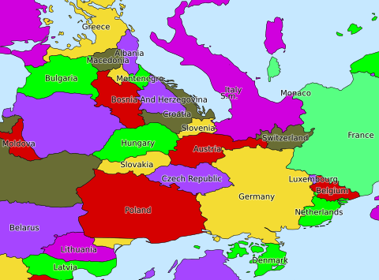

---
output:
  md_document:
    variant: markdown_github
---

# south up!

*south up!* provides easy creation of [south-up](https://en.wikipedia.org/wiki/South-up_map_orientation) and other custom world maps with 'unusual' projections in print quality.



rendering is based on the public domain vector data from [Natural Earth](http://www.naturalearthdata.com) (which need to be downloaded separately), fed to [mapnik](https://wiki.openstreetmap.org/wiki/Mapnik) to produce high quality cairo pdf output (rendering to raster images is also supported)

## installation

you need:

- mapnik 3.x + python-mapnik (with cairo support for pdf output)
- the [Natural Earth](http://www.naturalearthdata.com) data sets (automatic download script for linux [here](get-natural-earth-data.sh))

## examples

```
# south-up hobo-dyer
./southup.py --names --srs "+proj=cea +axis=wsu +lat_ts=37.5 +ellps=WGS84" hobodyer.pdf

# render to png, image height is computed automatically based on the
# aspect ratio of the projection (mollweide by default)
./southup.py --colors --width 3000 mollweide.png

# a bare white south-up WGS84 long/lat map with a 30 degree grid overlaid
./southup.py --srs "+proj=longlat +axis=wsu +ellps=WGS84 +datum=WGS84 +no_defs" --grid 30 wgs84longlat.pdf

# use a raster base image -- mapnik does not support reprojection of raster
# data, so you'll need to have gdal installed for this to work
./southup.py --raster data/GRAY_50M_SR_OB.tif --colors 13 rasterplusvector.pdf
```

the script makes use of a number of default styles that can be easily changed using mapnik stylesheets, see [southup.xml](southup.xml)

## usage

```{bash echo=FALSE}
 ./southup.py --help
```

## todos/bugs

- the halo of mapnik's `TextSymbolizer` labels does not seem to scale along with the font size when the output resolution is changed away from 72dpi
- add reliable support for shifted prime meridians (might require invoking `ogr2ogr` to fix wrapping at the shifted 'date line')
- add some nice colour schemes (and support for free specification from the command line)
- add options for city/capital symbols+labels
- look into data reordering using `ogr2ogr` to improve drawing of crowded labels

## license

copyright (c) 2017 kevin stadler
